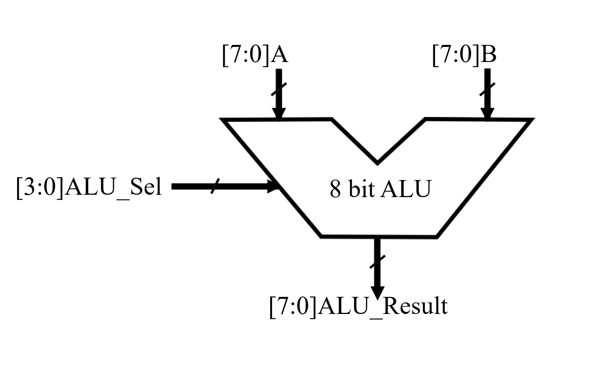
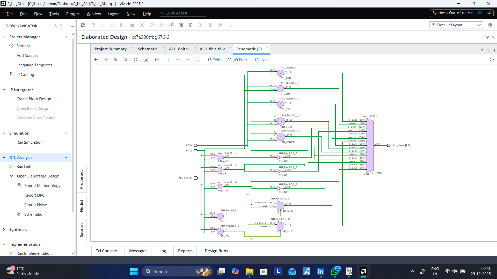
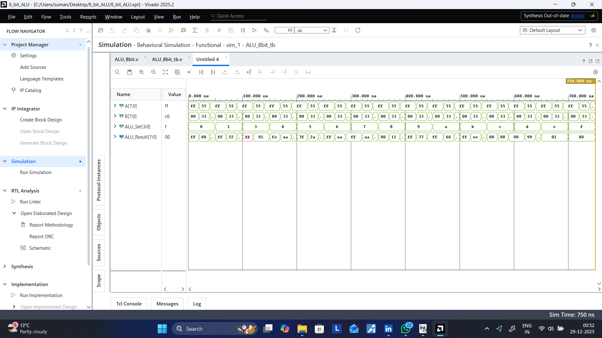

# 8-Bit Arithmetic Logic Unit (ALU) Design
Verilog-based 8-bit Arithmetic Logic Unit with Vivado simulation and RTL schematic.

## 📌 Project Overview
This project implements a fully functional **8-bit Arithmetic Logic Unit (ALU)** using Verilog HDL. The ALU is a fundamental building block of a Central Processing Unit (CPU), responsible for performing arithmetic and logic operations.

This design accepts two 8-bit inputs (`A` and `B`) and a 4-bit selection line (`ALU_Sel`) to determine the operation. The design has been verified using a custom testbench and simulated in **Xilinx Vivado**.

## 📸 Block Diagram & Design
Below is the conceptual block diagram of the ALU showing inputs `A`, `B`, and `Opcode(ALU_Sel)`, and the resulting output.

## ⚙️ Features & Operations
The ALU supports **15 distinct operations** controlled by the 4-bit `ALU_Sel` input.

| ALU_Sel | Operation | Description | Syntax (Verilog) |
| :--- | :--- | :--- | :--- |
| **Arithmetic** | | | |
| `0000` | Addition | `A + B` | `ALU_Result = A + B` |
| `0001` | Subtraction | `A - B` | `ALU_Result = A - B` |
| `0010` | Multiplication | *Reserved* | *(Requires 16-bit output)* |
| `0011` | Division | `A / B` | `ALU_Result = A / B` |
| **Shift/Rotate** | | | |
| `0100` | Logical Left Shift | `A << 1` | `ALU_Result = A << 1` |
| `0101` | Logical Right Shift | `A >> 1` | `ALU_Result = A >> 1` |
| `0110` | Rotate Left | Rotate bits left by 1 | `{A[6:0], A[7]}` |
| `0111` | Rotate Right | Rotate bits right by 1 | `{A[0], A[7:1]}` |
| **Logical** | | | |
| `1000` | AND | `A & B` | `ALU_Result = A & B` |
| `1001` | OR | `A \| B` | `ALU_Result = A \| B` |
| `1010` | XOR | `A ^ B` | `ALU_Result = A ^ B` |
| `1011` | NAND | `~(A & B)` | `ALU_Result = ~(A & B)` |
| `1100` | NOR | `~(A \| B)` | `ALU_Result = ~(A \| B)` |
| `1101` | XNOR | `~(A ^ B)` | `ALU_Result = ~(A ^ B)` |
| **Comparison** | | | |
| `1110` | Greater Than | If `A > B` Output High (1) else 0 | `ALU_Result = (A>B)?8'b1:8'b0;` |
| `1111` | Equal To | If `A == B` Output High (1) else 0 | `ALU_Result = (A==B)?8'b1:8'b0;` |

## 🛠 RTL Schematic
The synthesized design in Vivado produces the following RTL schematic, showing the internal logic gates and multiplexers.

## 📝 Code Logic Explanation
The design is implemented in a single Verilog module using behavioral modeling.

* *Module Interface:*
    The module defines 8-bit inputs A and B and a 4-bit ALU_Sel input. The output is an 8-bit register ALU_Result.

* *Behavioral Block (always):*
    The logic uses an always @(*) block (combinational logic). This ensures that ALU_Result updates immediately whenever A, B, or ALU_Sel changes.

* *Case Statement Decoding:*
    A case statement is used to decode the ALU_Sel input. This provides a parallel logic structure that synthesizes into a Multiplexer (MUX).
    * *Concatenation (Shift/Rotate):* The rotate operations utilize Verilog concatenation {}. For example, Rotate Left takes the MSB (Most Significant Bit) and moves it to the LSB position: {A[6:0], A[7]}.
    * *Default Case:* A default statement sets the result to 8'b0 to prevent the creation of unintentional latches during synthesis.
## 📊 Simulation & Verification
The design was verified using a behavioral testbench (`ALU_8bit_tb.v`). The simulation covers all opcodes, testing edge cases and standard operations.

### Testbench Strategy
The testbench uses *directed testing*, manually asserting specific values for A, B, and ALU_Sel to cover every case in the operation table.

### Waveform Result

## 📂 Source Code Structure
* **`ALU_8bit.v`**: The main module defining the ALU logic using a `case` statement.
* **`ALU_8bit_tb.v`**: The testbench file that generates stimuli (inputs A, B, and Select) to verify the design.

## 🚀 Getting Started
Clone the repository:
git clone https://github.com/yourusername/8_bit_ALU.git
cd 8_bit_ALU

## 🚀 How to Run
1.  Open **Xilinx Vivado**.
2.  Create a new RTL Project.
3.  Add `ALU_8bit.v` as a Design Source.
4.  Add `ALU_8bit_tb.v` as a Simulation Source.
5.  Run **Behavioral Simulation**.
   
## 📚 Learning Outcomes
- Designing combinational logic using Verilog
- Implementing shift and rotate operations
- Using conditional operators for comparisons
- Writing effective testbenches
- Visualizing RTL schematics and simulation waveforms
## 🙌 Acknowledgments
This project was developed as part of a digital design learning initiative, with a focus on RTL modeling and simulation. Special thanks to the Vivado community and documentation resources.
